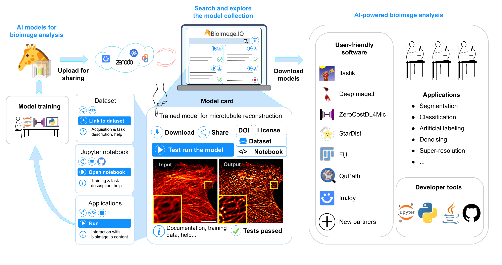

# Welcome to BioImage.io Documentation

Welcome to the official BioImage.io documentation. Here, you'll find comprehensive resources designed to support your journey through the fascinating world of bioimaging. Our documentation is structured to provide easy access to all the information you need, whether you're just starting out or looking to deepen your expertise.

## Quick Navigation

- **[Getting Started](/getting_started/README.md)**: Introduction to the BioImage Model Zoo ecosystem, who are we and how can you be part of it.
- **[Guides](/guides/README.md)**: In-depth tutorials and guides regarding the BioImage Model Zoo as a user, contributor or Community Partner.
- **[Tools and Resources](/tools_and_resources/README.md)**: Overview of the available tools and resources linked to the BioImage Model Zoo.
- **[Help Desk](/help_desk/README.md)**: A bit lost? Check the help desk for more information, a glossary page and how to contact us!
- **[Terms of Service](/terms_of_service.md)**: Usage policies and guidelines.
- **[Code of Conduct](/CODE_OF_CONDUCT.md)**: The code of conduct for the ecosystem.

## Explore and Discover

Dive into our documentation to explore the tools, resources, and support available to enhance your knowledge about the BioImage Model Zoo ecosystem. If you have any questions or need further assistance, our Help Desk is ready to assist you. Happy exploring!

## Reference publication
Wei Ouyang, Fynn Beuttenmueller, Estibaliz Gómez-de-Mariscal, Constantin Pape, Tom Burke, Carlos Garcia-López-de-Haro, Craig Russell, Lucía Moya-Sans, Cristina de-la-Torre-Gutiérrez, Deborah Schmidt, Dominik Kutra, Maksim Novikov, Martin Weigert, Uwe Schmidt, Peter Bankhead, Guillaume Jacquemet, Daniel Sage, Ricardo Henriques, Arrate Muñoz-Barrutia, Emma Lundberg, Florian Jug, Anna Kreshuk, **BioImage Model Zoo: A Community-Driven Resource for Accessible Deep Learning in BioImage Analysis**, bioRxiv 2022.06.07.495102, doi: [https://doi.org/10.1101/2022.06.07.495102](https://doi.org/10.1101/2022.06.07.495102)

