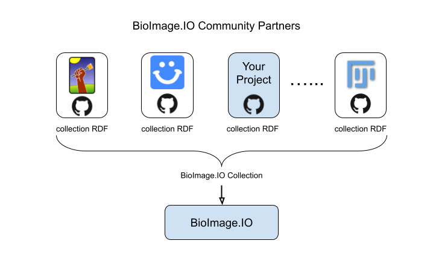

# Community Partners Guide
RI-SCALE Model Hub is a community-driven open source initiative, providing access to trained deep learning models and related resources contributed by the community members. To help us better disseminate and maintain the resources, we introduced the concepts of **community partner**. 

## Introduction to Community Partners

### What is a community partner?
Usually, a community partner is an organization, a company, a research group, or a software team (of one or more) that can consume and/or produce resources of the RI-SCALE model hub. Additionally, most partners continuously and openly contribute resources of their own. The first community partners represent open source consumer software of RI-SCALE Model Hub (e.g. ilastik, Fiji, deepImageJ, ZeroCostDL4Mic, StarDist).

### Benefits as a community partner
By joining RI-SCALE Model Hub as a community partner, you will be able to:
 - Participate in decision making process of the model specification.
 - Show your logo in RI-SCALE Model Hub and enable filtering models by compatibility with your software.
 - Connect CI to automatically test new model compatibility with your software and use other infrastructure features provided by RI-SCALE Model Hub.
 
### Responsibilities
The main responsibilities of a community partner are:
 - Use RI-SCALE Model Hub as their only primary trained model repository.
 - Review resources contributed by others that claim to be compatible with this community partner software.
 - Maintain this community partner's models and other resources in their linked repository, setup continous integration workflows to test models and keep them up-to-date with the latest spec.
 
### Who should join as a community partner?
 * A team behind a software which produces or consumes trained models compatible with the RI-SCALE Model Hub spec.
 * A organization, group, company or team (of one or more) who contributed and will keep contributing more models to RI-SCALE Model Hub.

### How does it work?
Community partners can host their own Github repository for storing models and other resources that are relevant. These resources are listed in a [collection RDF](https://github.com/bioimage-io/spec-bioimage-io/blob/gh-pages/collection_spec_latest.md)–a yaml file–which will be dynamically linked to the [central repository of RI-SCALE Model Hub](https://github.com/bioimage-io/bioimage-io-models). The [continuous integration (CI) service](https://github.com/bioimage-io/bioimage-io-models/actions) configured in the central repo will then pull the resources from partners' repo and compile them into items displayed in the RI-SCALE Model Hub website. Each community partner is responsible for maintaining the resources that are relevant. 



## Meet our Community Partners
Below is a list of our esteemed Community Partners who actively engage with the RI-SCALE Model Hub project, contributing their expertise, resources, and support to enhance the scientific research community.

<!-- ImJoyPlugin: {"type": "window", "hide_code_block": true, "startup_mode": "run"} -->
```html
<config lang="json">
{
  "name": "BioImageIO Community Partners",
  "type": "window",
  "tags": [],
  "ui": "",
  "version": "0.1.0",
  "cover": "",
  "description": "Create a table for the modelhub.riscale.eu community partners",
  "icon": "extension",
  "inputs": null,
  "outputs": null,
  "api_version": "0.1.8",
  "env": "",
  "permissions": [],
  "requirements": ["https://cdnjs.cloudflare.com/ajax/libs/react/17.0.2/umd/react.production.min.js", "https://cdnjs.cloudflare.com/ajax/libs/react-dom/17.0.2/umd/react-dom.production.min.js", "https://cdnjs.cloudflare.com/ajax/libs/babel-standalone/6.26.0/babel.min.js", "https://cdn.tailwindcss.com"],
  "dependencies": [],
  "defaults": {"w": 20, "h": 10}
}
</config>

<attachment name="react-src">
// Main React App Component
const App = () => {
  const [partners, setPartners] = React.useState([]);

  // Fetch JSON data from the URL
  React.useEffect(() => {
    fetch('https://raw.githubusercontent.com/bioimage-io/collection-bioimage-io/gh-pages/collection.json')
      .then(response => response.json())
      .then(data => {
        if (data.config && data.config.partners) {
          setPartners(data.config.partners);
        } else {
          setPartners([]);
        }
      })
      .catch(err => console.error(err));
  }, []);

  return (
    <div className="flex flex-col justify-center items-center min-h-screen bg-gray-100 text-gray-800 w-full">
      <div className="p-8 bg-white shadow-md rounded-lg w-full h-full">
        <h1 className="text-2xl font-bold mb-4">Community Partners</h1>
        <table className="min-w-full bg-white w-full h-full">
          <thead className="bg-gray-800 text-white">
            <tr>
              <th className="py-2">Community Partner</th>
              <th className="py-2">Documentation</th>
              <th className="py-2">Contact</th>
            </tr>
          </thead>
          <tbody className="text-gray-700">
            {partners.map((partner, index) => (
              <tr key={index}>
                <td className="py-2 px-4">{partner.name || 'N/A'}</td>
                <td className="py-2 px-4">{partner.docs || 'N/A'}</td>
                <td className="py-2 px-4">
                  {partner.contact ? (
                    partner.contact.map((contact, i) => (
                      <div key={i}>
                        <div>Name: {contact.name || 'N/A'}</div>
                        <div>Github: {contact.github || 'N/A'}</div>
                        <div>Email: {contact.email || 'N/A'}</div>
                      </div>
                    ))
                  ) : (
                    'N/A'
                  )}
                </td>
              </tr>
            ))}
          </tbody>
        </table>
      </div>
    </div>
  );
};

// Render the App component
ReactDOM.render(<App />, document.getElementById('root'));

</attachment>
<script lang="javascript">
async function loadBabelScript(content) {
  return new Promise((resolve, reject) => {
      const script = document.createElement('script');
      script.type = 'text/babel';
      script.setAttribute('data-presets', 'react');
      script.textContent = content;
      script.onerror = function() {
        reject(new Error('Failed to load the Babel script.'));
      };
      document.head.appendChild(script);
      setTimeout(()=>{
        try{
            Babel.transformScriptTags();
            resolve('Babel script has been loaded!');
         } catch (error) {
          reject(error);
        }
      }, 0);
  });
}
    
class ImJoyPlugin {
  async setup() {
    await api.log('initialized')
  }

  async loadJsxScript(script){
      await loadBabelScript(script);
  }

  async run(ctx) {
    if(ctx.data && ctx.data.jsx_script)
      await loadBabelScript(ctx.data.jsx_script);
    else
      await loadBabelScript(await api.getAttachment('react-src'));
  }
}

api.export(new ImJoyPlugin())
</script>

<window lang="html">
<div id="root"></div>
</window>

<style lang="css">
</style>
```


## How to join as a community partner?

Note that in order to contribute resources to the RI-SCALE Model Hub you do not need to become a community partner. How to contribute resources is described [here](/docs/guides/developers-guide.md).


If you are eligible and willing to join as a community partner, please submit a request issue [here](https://github.com/bioimage-io/collection/issues/new) with relevant information including the following:
1. Description of your software, organization, company or team.
2. Description of the resources that you plan to contribute. Please also include the url to your project repo.
3. Description of future plans on how your project will be maintained.

The admin team of RI-SCALE Model Hub will discuss the request and decide whether to approve or decline. We will mainly check whether the project are beneficial for the users of RI-SCALE Model Hub and the requirements for participation are met.

Upon approval, we will guide you to follow these steps in order to incorporate your contribution to RI-SCALE Model Hub:

1. First, you will need to create a PR to insert relevant metadata into [bioimageio_collection_config.json](https://github.com/bioimage-io/collection/blob/4087336ad00bff0198f5de83c94aa13be357840d/bioimageio_collection_config.json) under `"partners"`. 
Checkout [ilastik partner entry](https://github.com/bioimage-io/collection/blob/4087336ad00bff0198f5de83c94aa13be357840d/bioimageio_collection_config.json#L283-L301) for an example.
2. Then, you will need to add the Community Partner Compatibility Checks. Any community partner is invited to add a GitHub Actions workflow in this repo (please make a PR) that generates reports on its software compatibility with new and updated resources in the modelhub.riscale.eu collection.
See [ilastik compatibility checks worfklow](https://github.com/bioimage-io/collection/blob/main/.github/workflows/check_compatibility_ilastik.yaml) for an example.


## How to register a software or application?

A community partner can have one or multiple associated software, you can register them in the collection RDF file of your repository (see the previous section about creating a collection repository). A software is categorized as "Application" in the RI-SCALE Model Hub. The first thing to do is to create an application file in the [ImJoy plugin file format](https://imjoy.io/docs/#/development?id=plugin-file-format). This basically allows you define a landing page for your software with executable features such as download or test run buttons for your software. The most common use case is to create a landing page for your software. Each software will have an unique id, typically in the format of `<community partner id>/<software name>`. Every model can add links (manually when upload or automatically via the CI) to the software. For each model, the user can click the link on top of the model card, and the landing page will be loaded. Through the ImJoy plugin mechanism, the context information contains the current model information will be injected to the landing page, it's up to the developer who made the software app to decided how to use those information.

To see an example, you can find the [source for the ilastik app](https://github.com/ilastik/bioimage-io-resources/blob/main/src/ilastik-app.imjoy.html) and also the corresponding entry in the collection file [here](https://github.com/ilastik/bioimage-io-resources/blob/2d2f1b12b185b1b880bfb679ed2aa981bf88d1ed/collection.yaml#L45-L59).


## RI-SCALE Model Hub Partner Collection

A RI-SCALE Model Hub partner collection is a YAML file in GitHub repository of a community partner. The file adheres to the collection RDF specification described [here](https://github.com/bioimage-io/spec-bioimage-io#collection-resource-description-file-specification).

The appearance of the partner collection on the website can be customized by the `config` field as described in the next section.  

### Customizing appearance on modelhub.riscale.eu

Like any RDF, a collection RDF may have a `config` field to hold non-standardized metadata. We currently use some of this metadata to customize the partner collection appearance on the modelhub.riscale.eu website. The fields used here are subject to change, but as a community partner we'll keep you in the loop on any changes here and will likely formalize this part in the future.

A typical partner collection RDF `config` field may look like this:

```yaml
config:
  # a url for the user to get more details about the collection or your project
  # it can be a markdown file (*.md) hosted on github, you need to use the `raw` url
  # or an external link to your website
  about_url: http://details_about_my_collection

  # these tags will be used to filter items when the user select this collection
  tags:
    - awesome

  # the logo for the collection, you can use an emoji or a url to a png/jpg/gif/svg image
  logo: 🦒

  # the icon for your collection you can use an emoji or a url to a png/jpg/gif/svg image
  # note, this must be a square or contained in a square
  icon: 🦒


  # settings for the splash screen
  splash_title: Awesome Collection 
  splash_subtitle: Awesome Collection is Awesome!
  splash_feature_list:
    - Easy to use...
    - It's just awesome...
  explore_button_text: Start Awesomeness
  background_image: static/img/zoo-background.svg

  # the available resource types in your collection
  resource_types:
    - model
    - application
    - notebook
    - dataset

  # the default resource type you want to set, set to `all` if you want to show all your items by default
  default_type: all
```

You can find a complete example [here](https://github.com/ilastik/bioimage-io-models/blob/master/collection.yaml).

If you want to join as a community partner, please send the link to RI-SCALE Model Hub by following the instructions for [joining community partners](https://blob/master/docs/community_partners/how_to_join.md).

## How to contribute tests summaries

As RI-SCALE Model Hub community partner may contribute test summaries. As defined in [bioimageio.core](https://github.com/bioimage-io/core-bioimage-io-python/blob/d435fcdb38c8b2152ac0d20f61ee498d88e7f1d0/bioimageio/core/common.py#L4) a test summary is a dictionary with the following keys:
 - name: str
 - source_name: str
 - status: Literal["passed", "failed"]
 - error: Union[None, str]
 - traceback: Optional[List[str]]
 - nested_errors: Optional[Dict[str, dict]]
 - bioimageio_spec_version: str
 - bioimageio_core_version: str
 - warnings: dict

In the [RI-SCALE Model Hub collection template](https://github.com/bioimage-io/collection-bioimage-io/blob/main/collection_rdf_template.yaml), where a community partner is registered, the location of `test_summaries` and how to trigger them can be specified as well.
The location of partner test summaries is specified by a GitHub repository `repository`, where test summaries are hosted in `deploy_branch`/`deploy_folder`.
To update the test summaries (for new or updated resources) `workflow` specifies a GitHub Actions workflow to trigger from `workflow_ref` by @bioimageiobot. 
For the automatic trigger machanism to work the partner `repository` needs to invite @bioimageiobot as a collaborator and the `workflow` needs to run on `workflow_dispatch` with a `pending_matrix` input.

Let's take a look at an example: the [ilastik partner entry](https://github.com/bioimage-io/collection-bioimage-io/blob/aa4742d33394809e44e63ce48f9bac9ad3518122/collection_rdf_template.yaml#L63-L68
) below specifies that test summaries are hosted at [ilastik/bioimage-io-resources/tree/gh-pages/test_summaries](https://github.com/ilastik/bioimage-io-resources/tree/gh-pages/test_summaries). 
The [test_bioimageio_resources.yaml](https://github.com/ilastik/bioimage-io-resources/blob/main/.github/workflows/test_bioimageio_resources.yaml) is regularly dispatched by @bioimageiobot to keep test summaries up-to-date.

```yaml
id: ilastik
repository: ilastik/bioimage-io-resources
branch: main
collection_file_name: collection.yaml
test_summaries:
  repository: ilastik/bioimage-io-resources
  deploy_branch: gh-pages
  deploy_folder: test_summaries
  workflow: test_bioimageio_resources.yaml
  workflow_ref: refs/heads/main
```

The test summaries are expected to follow the folder/file name pattern "<resource_id>/<version_id>/test_summary_*.yaml", where * can be any string to differentiate different test settings.

### Display of partner test summaries

Once a community partner is registered to contribute test summaries with the `test_summaries` data explained above, the main [RI-SCALE Model Hub CI](https://github.com/bioimage-io/collection-bioimage-io/blob/main/.github/workflows/auto_update_main.yaml) collects these summaries. The collection including these collected test summaries are displayed on modelhub.riscale.eu. Currently test summaries are rendered like so:


### Updating test summaries

The main [RI-SCALE Model Hub CI](https://github.com/bioimage-io/collection-bioimage-io/blob/main/.github/workflows/auto_update_main.yaml) triggers the partner's CI for new or updated resources.
Additionally, the parter may decide at any time to rerun (some of) their tests if changes on their side (like a new version release of their software) requires additional tests or a reevaluation. 
