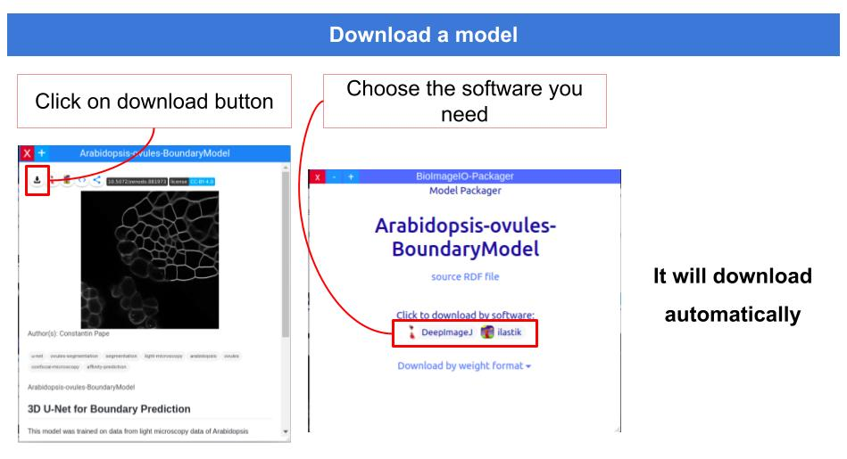

# User Guide
This guide is intended for users wanting to consume or use models from the BioImage Model Zoo. There are plenty of models in the BioImage Model Zoo that you can use in your own software, in the software of our community partners or you can even download them and use them in a notebook or code of your own.

## Downloading and using Models from the BioImage Model Zoo

See a [video](https://oc.embl.de/index.php/s/eJOIdzDVJpToETd) about using a model from the BioImage Model Zoo in different software.

## Using BioImage Model Zoo models in different software

### BiaPy
TBD

### DeepImageJ

**Note: deepImageJ supports PyTorch and Tensorflow 1 models**

1. Install the [deepImageJ plugin](https://deepimagej.github.io/download.html) in ImageJ.
This will give you all the necessary Plugins to run bioimage.io models at the moment.

2. Install a model from the [BioImage Model Zoo](https://bioimage.io/):
      1) Download a deepImageJ model from the BioImage Model Zoo repository.
      2) Use `DeepImageJ Install Model` in ImageJ to install the `.zip` file that you just downloaded: choose the `Private model` option and `From ZIP file`.
      3) In the `zip` file you just downloaded, there is an `exampleImage.tif`that you can open in ImageJ and process with the model you just downloaded.
      4) See a detailed tutorial [here](https://deepimagej.github.io/tutorials.html).      

### Fiji
**Note: Fiji only supports Tensorflow 1 models at the moment!**

1. Install the [CSBDeep-Plugin](https://github.com/CSBDeep/CSBDeep_website/wiki/CSBDeep-in-Fiji-%E2%80%93-Installation) in Fiji.
This will give you all the necessary Plugins to run bioimage.io models at the moment.
2. Open the image you want to run the model on
3. a) If your model is a [CSBDeep](https://imagej.net/CSBDeep) one, go to Plugins > CSBDeep and choose either "N2V", "DenoiSeg" or "Run your network"(default)
   
   b) For any other bioimage.io model, go to Plugins > bioimage.io > bioimage.io prediction. 
4.  Continuing from 3b) you will arrive at this window:

The configuration fields should be self-explanatory.

5. Click "OK" to run the model prediction.

### Ilastik
TBD

###  ImJoy
TBD

### ZeroCostDL4Mic
**Note: [ZeroCostDL4Mic](https://github.com/HenriquesLab/ZeroCostDL4Mic/wiki) allows you trainig models and upload them to the BioImage Model Zoo or fine-tune existing ones!**

1. Download a ZeroCostDL4Mic model from the [BioImage Model Zoo](https://bioimage.io/) repository. 
2. Unzip the model `.zip` file so you can use it later in the notebook.
3. Open the ZeroCostDL4Mic notebook that corresponds to the model you downloaded. 
4. When required, specify the path to the unziped folder containing the model.

## Best Practices for Model Usage
TBD

## Use Cases
- [Use-case 1: Stardist H&E nucleus segmentation](https://github.com/bioimage-io/use-cases/tree/main/case1-stardist)
- [Use-case 2: 3D U-Net for cell-segmentation in light microscopy](https://github.com/bioimage-io/use-cases/tree/main/case2-finetuning)
- [Use-case 3: Classification, imjoy & python library usage](https://github.com/bioimage-io/use-cases/tree/main/case3-devtools)
- [Use-case 4: Domain adaptation for mitochondria segmentation in EM](https://github.com/bioimage-io/use-cases/tree/main/case4-research)